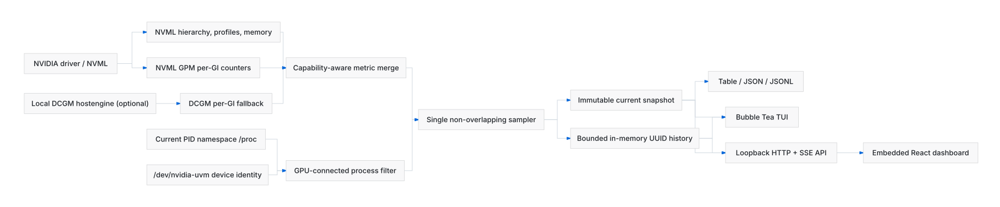

# Architecture

The editable diagram source is `assets/architecture.mmd`.

## Runtime shape

Core MIGLens is one Linux process and one executable. A single sampling loop
owns provider access and publishes complete snapshots. The TUI, streaming CLI,
and HTTP server only consume those snapshots; they never poll NVIDIA APIs
independently. Slow consumers receive the newest complete snapshot rather than
building a queue. An optional Kubernetes bridge is a separate least-privilege
process and communicates only through a configured local Unix socket.

The loop is synchronous by design. Expensive GPM/DCGM entities are staggered
across ticks and `/proc` inventory is cached at independent default two-second
cadences. Cached metrics retain their true sample time and expire to `stale`.
If a poll takes longer than its interval,
the next deadline is advanced past the current time, so overlapping NVML/DCGM
calls and accumulated lag are impossible. A provider error triggers one
immediate full retry. Persistent errors publish a retained-topology snapshot
whose formerly available values are `stale` and `null`.

The browser can change the process-local cadence to 500 ms, one second, or two
seconds. An update resets the next deadline relative to the change and is
coalesced with any rapid subsequent updates. It never starts a second provider
poll. The profiling and process cadences remain read-only runtime settings. The
startup CLI, environment, or TOML values return after a restart.

## Domain invariants

- The hierarchy is always GPU → GI → CI. A one-CI GI may be flattened only by
  presentation code.
- GPM/DCGM activity and GI memory stay on the GI. They are never divided or
  copied onto child CIs.
- Temperature, power, and clocks stay on the physical GPU.
- PCIe RX/TX is stored as bytes per second at its measured physical-GPU or GI
  scope. DRAM/memory activity remains a percentage and is not relabeled as
  framebuffer bandwidth.
- A missing value is a nil pointer and serializes as JSON `null`; it is never
  replaced with zero.
- Every measurement has source, scope, sample time, and status.
- Stable device UUIDs remain API identifiers for history and attribution joins,
  while routine dashboard views use the numeric GPU/GI/CI hierarchy. Internal
  `@gN` generations keep history from joining a removed and later recreated GI
  or CI.
- Provider merge precedence is GPM → DCGM → NVML, but an available lower-level
  value wins over an unavailable higher-level value.

## Providers

`internal/provider/nvml` uses NVIDIA's Go NVML binding for discovery, physical
metrics, memory, MIG attributes, power limits, and GPM activity/PCIe rates. It deliberately does not call NVML's
host-process or placement APIs and never executes `nvidia-smi`. Device handles
are discovered on each sample, so live topology changes are visible without
restarting.

`internal/provider/dcgm` decorates an NVML snapshot. It creates a local DCGM
GI entity group, refreshes that group at the configured topology interval,
and merges profiling fields only where GPM lacks an available canonical
metric. Blank DCGM profiling sentinels produce a paused/conflict diagnostic.

`internal/provider/fake` supplies sanitized deterministic scenarios for UI,
contract, and resilience tests.

## Optional scheduler attribution

The attribution decorator is disabled unless an absolute Unix-socket path is
configured. When enabled, it polls a versioned, bounded JSON document in the
background and enriches snapshots without entering the NVIDIA sampling path.
Unavailable or stale attribution never fails a GPU sample or `/healthz`.

The separate Kubernetes bridge watches DRA ResourceClaims in explicitly
configured namespaces and NVIDIA ResourceSlices. It joins the complete
`(driver, pool, device)` identity and emits only hashed workload and consumer
scope references, Coder display names, and physical-GPU or compute-instance
UUID assignments. An assignment is not evidence of active execution. See
[Kubernetes attribution](kubernetes-attribution.md).

## GPU processes

The workspace decorator enumerates numeric entries from MIGLens' current
`/proc` view and compares each process' file-descriptor device metadata with
`/dev/nvidia-uvm`. Identity fields are resolved only after a match. An open UVM
handle includes idle CUDA contexts; it does not prove current kernel execution,
GPU memory consumption, or GPU/GI/CI ownership. MIGLens excludes itself.

For matches, the collector resolves PID, user, executable path with `comm`
fallback, and start time; command arguments are read only when explicitly
enabled. PID plus start time provides a stable identity across PID reuse.
Processes that disappear mid-sample are skipped, while partially readable rows
retain explicit status and diagnostics. Unreadable FD directories are reported
in aggregate, while a readable namespace with zero matches is healthy.

The process list is top-level snapshot data. It is neither associated with a
GPU nor stored in history. With attribution configured, MIGLens reads the
cgroup path of each detected GPU client, recognizes Kubernetes Pod UIDs in
cgroup v1/v2 systemd or cgroupfs layouts, and joins a one-way hash to the
bridge's consumer scope. Only the resulting workload reference enters the
public snapshot. No device ownership is inferred, and MIGLens does not inspect
container runtimes, process environments, Pod objects, or another PID
namespace.

## History and reconfiguration

History is a map of dynamically growing fixed-capacity rings. Rings allocate
only the points they contain, are capped by `window / interval + 2`, and are
removed after their final sample falls outside the configured window. This
keeps both steady operation and rapid UUID churn bounded.

Switching to a faster cadence grows every existing ring while preserving
chronology. Capacity never shrinks during the process lifetime, so a later
slower cadence cannot discard already retained samples. Queries still enforce
the configured retention window, which defaults to one hour.

The history API maps a stable current UUID to its internal generation key and
then removes that suffix from the response. Old generations naturally expire
but cannot contaminate the current chart. An optional point budget applies a
strict multi-metric min/max envelope while preserving endpoints.

`POST /api/v1/history/aligned` serves overview history for multiple requested
entities on one shared timestamp grid. Every response row represents one
timestamp across the requested series. Its required `maxPoints` value is
validated from 50 through 5000 and strictly caps the number of shared rows.
MIGLens never interpolates or carries values forward: a missing measurement
remains absent, and a failed collector attempt is retained as an empty shared
row so clients render a real gap. The legacy single-entity
`GET /api/v1/history` endpoint remains available for detail views and API
compatibility.

## API and browser boundary

`api/openapi.yaml` is the contract source. `go generate ./internal/api`
produces Go wire types and `npm run generate:api` produces TypeScript types.

The server binds only to loopback after an explicit address check. GPU state
and telemetry have no mutation routes; the sole mutation changes the current
process' sampling cadence and requires JSON. A read-only version endpoint
reports linker-supplied build metadata. Security headers deny framing and
restrict scripts, fonts, images, and connections to local embedded assets. No
CORS headers are emitted. Negotiated gzip covers JSON, embedded text assets,
and flush-safe SSE. SSE sends sequence IDs, reconnect guidance, the latest
snapshot, and effective settings on every new subscription.

The React client owns one `EventSource` and keeps the last complete snapshot
during reconnects. Its GPU perspective organizes host-wide topology and
telemetry by device. Its People perspective groups scheduler assignments by
Coder user and workspace without treating reserved or allocated resources as
evidence of active use. Charts and processes remain host-wide; a process may
show its joined workspace but never claims a particular GPU, GI, or CI.

The overview loads one aligned history batch per panel and refetches whenever
the exact panel, topology, or selected range changes in either direction. SSE
samples received during a request are merged by timestamp up to server
retention, and stale responses are ignored. The shared grid keeps series
continuous and comparable while preserving real gaps. Single-entity detail
views continue to use the legacy history query. The browser-local view can be
5, 15, 30, or 60 minutes; settings events keep cadence controls synchronized
across tabs. Missing values remain chart gaps and reset the trailing five-second
average. Both the server response and rendered rows use strict 720-row caps for
the dashboard. The overview chart bundle and GI/CI detail drawer are lazy-loaded.

## Shutdown

The command context cancels the collector. The polling goroutine exits, GPM
samples are freed, DCGM field/entity groups are destroyed, and the HTTP server
receives a bounded graceful shutdown.
